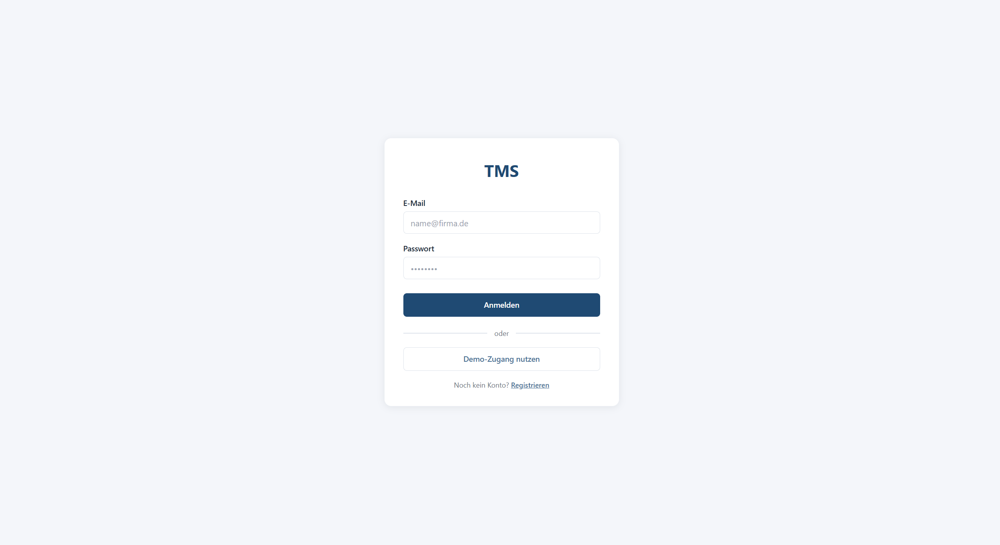
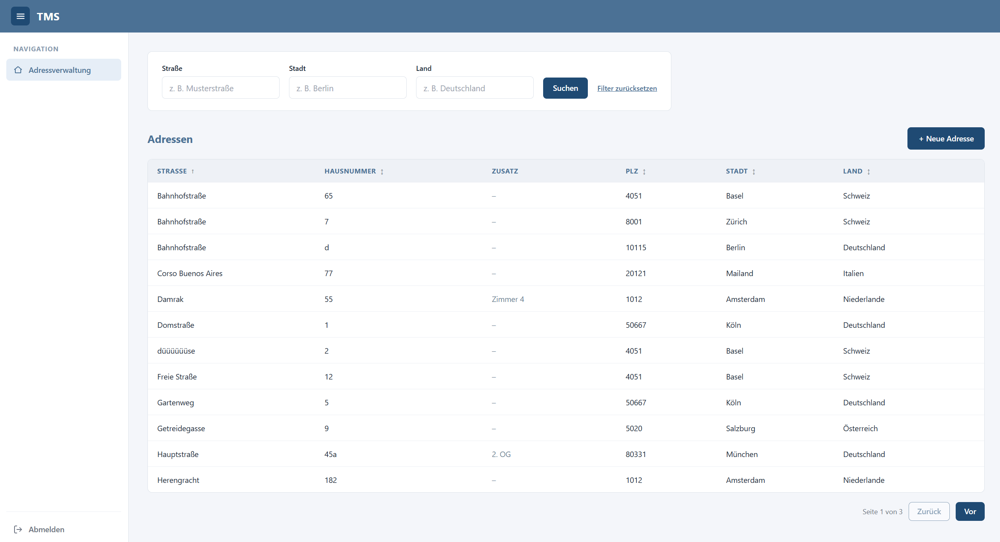
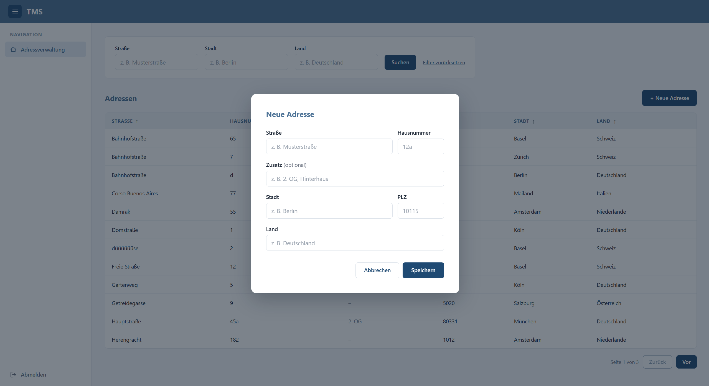

# TMS – Adressverwaltung

Client/Server-Anwendung zur Verwaltung von Adressen.  
Backend: .NET 10 / ASP.NET Core Web API · Datenbank: PostgreSQL · Frontend: Angular (Standalone Components, Signals).

**Arbeitsaufwand:** ca. 5 h 30 min

## Funktionen

- Adressen erfassen, bearbeiten und löschen (Straße, Hausnummer, Zusatz, PLZ, Stadt, Land)
- Liste mit kombinierbaren Filtern (Straße, Stadt, Land; case-insensitive, Teilstring), Paging serverseitig
- Sortierung nach allen Spalten (auf- und absteigend), wählbar per Klick auf den Spaltenheader
- Autocomplete-Vorschläge in Filter und Formular
- Validierung im Frontend (feldspezifisch) und im Backend (FluentValidation)
- Login und Registrierung (JWT), Demo-Zugang per Button
- Responsives Layout: Tabelle auf Desktop, Karten-Ansicht auf Mobile (< 768 px)

## Screenshots

| Login | Adressliste | Adresse anlegen |
|---|---|---|
|  |  |  |

## Voraussetzungen

| Tool | Version |
|---|---|
| .NET SDK | 10.x |
| Node.js | 20 oder neuer |
| Angular CLI | `npm install -g @angular/cli` |
| Docker | für PostgreSQL |

## Start

### 1. Datenbank

```powershell
docker compose up -d
```

PostgreSQL läuft auf `localhost:5432` (DB `tms`, User/Passwort `postgres`).

### 2. Backend

```powershell
dotnet tool restore
dotnet run --project src\Api\TMS.Api.csproj
```

Beim Start werden die Migrationen automatisch angewendet und Demo-Daten eingespielt
(3 Länder, 7 Städte, 12 Adressen, Demo-Benutzer). Das Backend hört auf `http://localhost:5078`.  
OpenAPI-Schema: `http://localhost:5078/openapi/v1.json`.

### 3. Frontend

```powershell
cd tms-frontend
npm install
npm start
```

Die App läuft auf `http://localhost:4200`.

### Login

Über **„Demo-Zugang nutzen"** einloggen oder mit `demo@tms.dev` / `Demo1234`.  
Alternativ über „Registrieren" ein eigenes Konto anlegen.

## API-Dokumentation

Die API ist im Development-Modus interaktiv dokumentiert und testbar über **Scalar**:

```
http://localhost:5078/scalar/v1
```

Scalar zeigt alle Endpoints mit Parametern, Request/Response-Schemas und Code-Beispielen
in mehreren Sprachen. Das zugrundeliegende OpenAPI 3.0-Schema ist direkt abrufbar unter
`http://localhost:5078/openapi/v1.json`.

## Tests

```powershell
dotnet test
```

Enthalten sind Validator-Tests und Handler-Tests (Repositories gemockt mit NSubstitute).

## Konfiguration

| Einstellung | Ort | Standard |
|---|---|---|
| Connection String | `src/Api/appsettings.json` → `ConnectionStrings:DefaultConnection` | localhost / `tms` |
| JWT-Schlüssel | `Jwt:SigningKey` bzw. Umgebungsvariable `Jwt__SigningKey` | Dev-Key im Repo |
| API-URL im Frontend | `tms-frontend/src/app/core/api-config.ts` | `http://localhost:5078` |

Der Dev-Signing-Key liegt bewusst im Repo, damit der Start ohne Setup funktioniert.  
In Produktion muss er per Umgebungsvariable oder Secret-Store gesetzt werden.

## Migrationen

Zwei DbContexts (`AddressesDbContext`, `AuthDbContext`), daher immer mit `--context`:

```powershell
dotnet tool run dotnet-ef -- migrations add <Name> `
  --context AddressesDbContext `
  --project src\Modules\Addresses\Infrastructure\TMS.Addresses.Infrastructure.csproj `
  --startup-project src\Api\TMS.Api.csproj `
  --output-dir Persistence\Migrations
```

Für Identity: `--context AuthDbContext` und das Projekt `src\Modules\Identity\Infrastructure\TMS.Identity.Infrastructure.csproj`.  
`dotnet-ef` ist als lokales Tool in `.config/dotnet-tools.json` hinterlegt – einmalig `dotnet tool restore`.

## API-Client

Das Frontend kommuniziert über handgeschriebene TypeScript-Services mit der REST-API
(`src/app/core/services/`). Das Backend stellt OpenAPI 3.0 unter
`http://localhost:5078/openapi/v1.json` bereit, alle Endpoints haben stabile
`operationId`s. Ein typsicherer generierter Client kann damit jederzeit erzeugt werden:

```powershell
# Beispiel mit ng-openapi-gen (Angular)
npm install --save-dev ng-openapi-gen
npx ng-openapi-gen --input http://localhost:5078/openapi/v1.json --output src/app/api
```

Für ein anderes Framework (React, Vue) wird derselbe Endpoint mit dem passenden
Generator verwendet – das Backend bleibt unverändert.

## Architektur

Modularer Monolith, pro Modul Clean Architecture:

```
src/
├── Api/                                   Host: Controller, Auth-Setup, Filter, Seed
└── Modules/
    ├── Addresses/
    │   ├── Domain/                        Entities (Address, City, Country)
    │   ├── Application/                   Handler, DTOs, Validatoren, Repository-Interfaces
    │   └── Infrastructure/                EF Core, Konfigurationen, Repositories, Migrationen
    └── Identity/
        ├── Application/                   Auth-Service-Interface, DTOs, Validatoren
        └── Infrastructure/                ASP.NET Core Identity, JWT
tests/Addresses/                           xUnit
tms-frontend/                              Angular
```

Abhängigkeitsrichtung: `Api → Application ← Infrastructure`, `Application → Domain`.  
Repository-Interfaces liegen in der Application-Schicht, weil sie dort konsumiert werden.  
Jedes Modul registriert sich über eigene Extension-Methoden (`AddAddressesApplication`, `AddAddressesInfrastructure`, …).

### Domänenmodell

```
Country (Id, Name, IsoCode?)  1 ── n  City (Id, Name, ZipCode, CountryId)  1 ── n  Address (Id, Street, HouseNumber, Supplement?, CityId)
```

Normalisiert: Orts- und Länderdaten liegen einmalig in eigenen Tabellen. Beim Speichern
einer Adresse werden Stadt und Land anhand der Eingabe gesucht oder angelegt
(Unique-Indizes verhindern Duplikate).

### Neues Modul ergänzen (z. B. Rechnungsverwaltung)

1. Projekte `TMS.Invoices.Domain/Application/Infrastructure` anlegen, in die Solution aufnehmen.
2. Eigenen DbContext mit eigenem Schema und eigenen Migrationen.
3. Extension-Methoden `AddInvoicesApplication` / `AddInvoicesInfrastructure` bereitstellen und in `Program.cs` aufrufen.
4. Controller im Host ergänzen. Alle Controller sind standardmäßig durch JWT geschützt (`RequireAuthorization`).
5. Module referenzieren sich nicht gegenseitig im Datenmodell: Verweise auf Adressen erfolgen
   nur über die `Guid`, ohne Fremdschlüssel über Modulgrenzen.

## Technische Entscheidungen

| Bereich | Entscheidung | Begründung |
|---|---|---|
| Persistenz | EF Core + Npgsql | Standard-ORM, Migrationen, LINQ-Queries laufen vollständig in der DB |
| Validierung | FluentValidation, per globalem Action-Filter | Regeln in der Application-Schicht, einheitlich 400 mit feldbezogenen Fehlern |
| Authentifizierung | ASP.NET Core Identity + JWT | Hashing, Lockout und Duplikatsprüfung vom Framework; JWT, da Frontend und API getrennt laufen |
| API-Dokumentation | Scalar (OpenAPI 3.0) | Interaktive Doku mit Code-Beispielen, direkt aus dem laufenden Backend generiert |
| Tests | xUnit, NSubstitute, FluentAssertions 7 | Handler gegen Repository-Interfaces testbar, ohne Datenbank |
| API-Client | Handgeschrieben, OpenAPI-Schema vorhanden | Schema mit stabilen operationIds bereit für Generator (ng-openapi-gen, nswag, o. ä.) |
| Frontend | Angular Standalone + Signals | Kein NgModule-Overhead, einfacher Zustand ohne zusätzliche State-Management-Bibliothek |
| Suche & Sortierung | Serverseitig, `ILIKE`, `ORDER BY`, Paging mit `Skip/Take`, `AsNoTracking` | Skaliert mit der Datenmenge, nichts wird im Speicher gefiltert oder sortiert |

## Bekannte Einschränkungen / nächste Schritte

- **Passwort zurücksetzen und E-Mail-Bestätigung** sind nicht umgesetzt (benötigen einen Mail-Dienst).
- **Token in `localStorage`**: einfach, aber XSS-anfällig. Besser wären httpOnly-Cookies und Refresh-Tokens.
- **Suche bei sehr großen Datenmengen**: `ILIKE '%…%'` kann keinen B-Tree-Index nutzen.
  Nächster Schritt: `pg_trgm` mit GIN-Index. `OFFSET`-Paging wird bei sehr tiefen Seiten langsamer (Alternative: Keyset-Paging).
- **Autocomplete für Straßen** schlägt nur Werte der aktuell geladenen Seite vor. Die Suche selbst durchsucht alle Daten.
- **Tests**: Unit-Tests für Validierung und Handler; keine Integrationstests gegen eine echte Datenbank.
- Migrationen und Seed laufen beim Start automatisch. Für Produktion gehört das in einen separaten Deployment-Schritt.
-  **Kein lokales Datencaching**: Liste wird bei jeder Aktion neu vom Server geladen – für größere Anwendungen wäre ein Cache-Service mit gezielter Invalidierung sinnvoll
